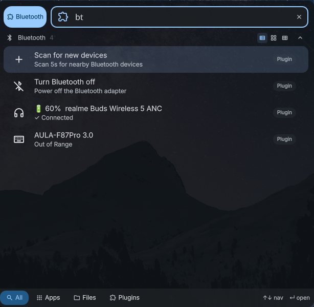
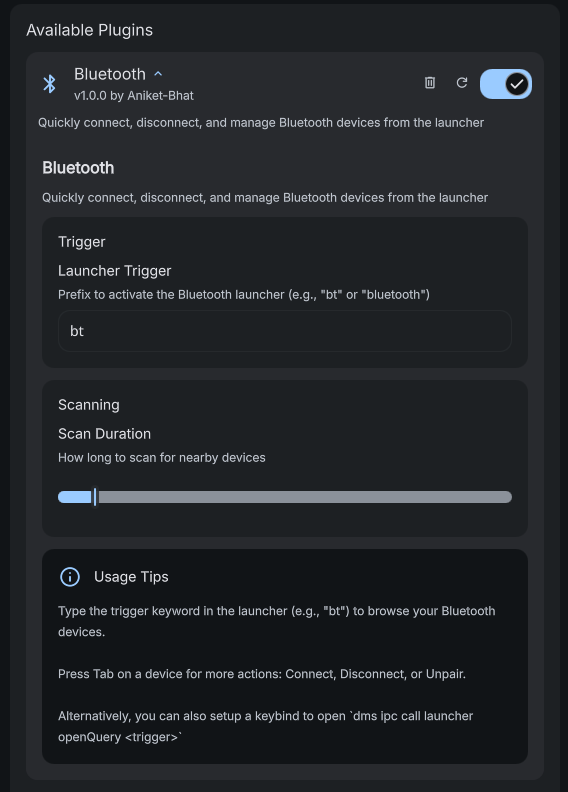

# Bluetooth Launcher

A [DankMaterialShell](https://github.com/AvengeMedia/DankMaterialShell) launcher plugin for managing Bluetooth devices directly from the launcher. Connect, disconnect, pair, unpair, and scan for devices — all keyboard-driven with real-time status and battery indicators.


# Screenshots

### UI



### Settings




## Installation

1. Clone or copy this plugin to your DankMaterialShell plugins directory:

   ```
   ~/.config/DankMaterialShell/plugins/AnimeCalendar/
   ```
2. Enable the plugin in DankMaterialShell settings

## Usage

1. Open the DankLauncher (default: `Mod+D`)
2. Type your trigger (default: `bt`) to open the Bluetooth device list
3. Select a device and press `Enter` to connect or disconnect
4. Press `Tab` on a device for additional actions: Connect, Disconnect, Forget

### Keyboard Shortcut

To open the Bluetooth launcher directly via a keybind, add it to your compositor config:

**Niri:**

```kdl
hotkey { key "Super+b"; action { spawn-sh "dms ipc call launcher openQuery bt"; } }
```

**Hyprland:**

```
bind = Super, b, exec, dms ipc call spotlight openQuery "bt "
```

## Configuration

Open **Settings → Plugins → Bluetooth** to configure:


| Setting          | Default | Description                                   |
| ------------------ | --------- | ----------------------------------------------- |
| Launcher Trigger | `bt`    | Prefix to activate the plugin in the launcher |
| Scan Duration    | `5s`    | How long to scan for nearby devices (3–30s)  |

## License

MIT License

## Credits

- Built for [DankMaterialShell](https://github.com/your-repo/DankMaterialShell)
